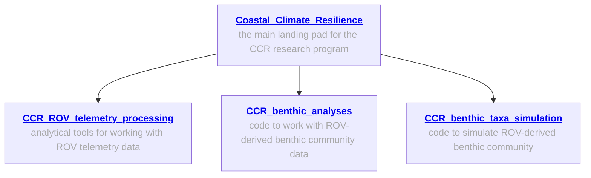
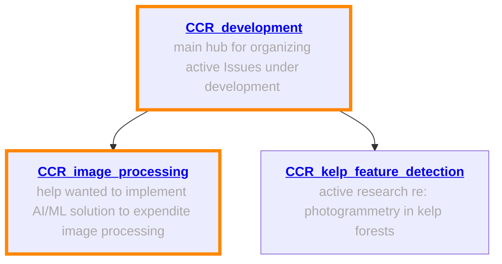

# CCR_kelp_feature_detection

## Overview
This repo is intended to aggregate information regarding the testing of various feature detectors upon temperate, kelp forest benthic imagery. 
Preliminary evidence suggests that the feature detectors used in photogrammetry methods struggle with the dark and homogenous nature of kelp and other algae. 
Accordingly, our team is unaware of photogrammetry models being successfully developed from kelp forest imagery (though if anyone is aware of them, please share at https://github.com/Seattle-Aquarium/CCR_kelp_feature_detection/issues/8!
The purpose of this repo is to enable targeted testing of various feature detectors against kelp forest (and other algae) imagery, in the hope that future photogrammetry efforts may be succesfully deployed within kelp forests. 

Note that a second issue exists re: photogrammetry and kelp -- the movement of vegetation (due to surge, current, etc.) may break the underlying assumptions of a static environment that these photogrammetry models rely on. 
This is very likely a larger issue, and one which we are not focused on here. 

A folder with 25 photos that exhibit a range of substrate and vegetation conditions for feature detector testing can be found [here](https://github.com/zhrandell/CCR_kelp_feature_detection/tree/main/photos). To provide a more robust testing scenario, we've including the following files for all 25 images. 

- [unedited_GPR](https://github.com/Seattle-Aquarium/CCR_kelp_feature_detection/tree/main/photos/unedited_GPR) -- the "raw" photo file taken by GoPro; .GPR is a proprietary file type that we cannot write, but we can view and edit these files in Adobe Lightroom; maximum sensor information retained.
- [unedited_TIFF](https://github.com/Seattle-Aquarium/CCR_kelp_feature_detection/tree/main/photos/unedited_TIFF) -- we converted the .GPR to .TIFF to provide an unedited file format that retains much (but not all) of the original sensor information contained within the .GPR file. 
- [edited_TIFF](https://github.com/Seattle-Aquarium/CCR_kelp_feature_detection/tree/main/photos/edited_TIFF) -- these were included the enable "pre" and "post" photo editing .TIFFs (though the file size is much larger).
- [edited_JPEG](https://github.com/Seattle-Aquarium/CCR_kelp_feature_detection/tree/main/photos/edited_JPEG) -- our "standard" file output for edited (color-corrected, denoise, etc.) photos that are then processed with AI/ML to extract percent-cover and abundance data. 

We've applied our trained AI/ML algorithm (via [CoralNet-Toolbox](https://github.com/Jordan-Pierce/CoralNet-Toolbox)) to these 25 images, with 100 uniformly distributed (224 x 224 pixel) percent-cover patches per image. The predicted annotations for 2500 patches were manually reviewed and any errors were corrected. The .csv output can be found [here](https://github.com/Seattle-Aquarium/CCR_kelp_feature_detection/blob/main/data_output/25_images_percent-cover.csv), and it includes the (pixel) location information for all percent-cover patches. See https://github.com/Seattle-Aquarium/CCR_kelp_feature_detection/issues/1 for more information about the creation of these percent-cover data. 

  
  
 

  
 

## General information; workflows ready to implement
The following repos contain general information about our work, and specialized repos for ROV telemetry analyses, processing and analyses of ROV-derived benthic abundance and distribution data, and simulating benthic data.  

## Help wanted! 
The following repos involve active areas of open-source software development, AI/ML implementation, and computer vision challenges; areas where we could use assistance are 🔶 highlighted in orange 🔶

